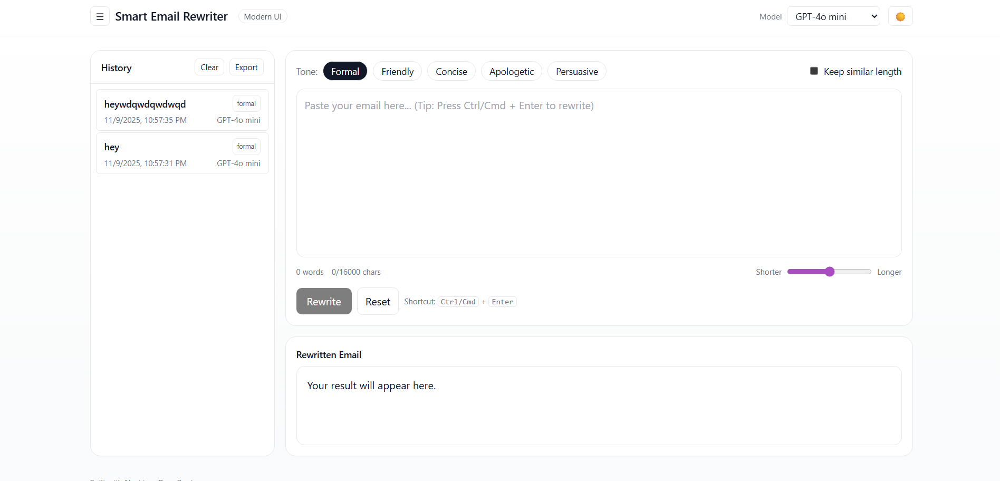
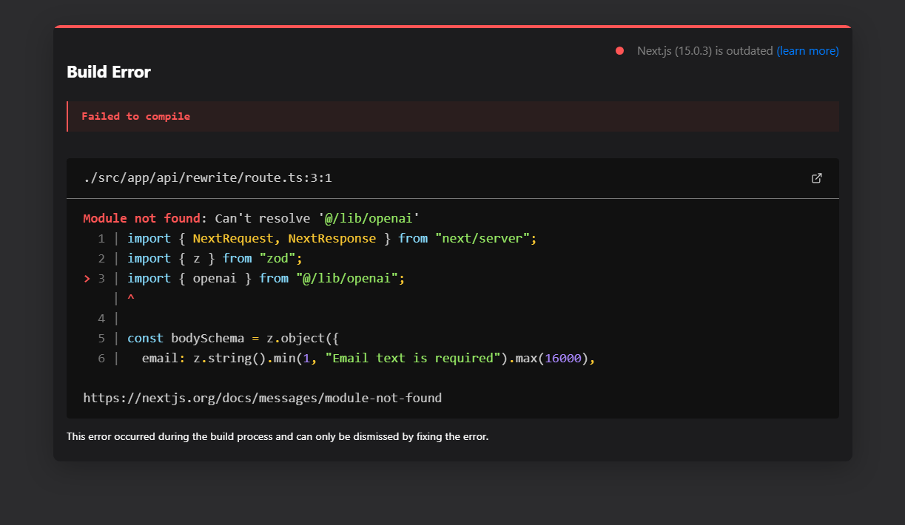

# ✉️ Smart Email Rewriter

🚀 **AI-powered email tone optimizer** — rewrite any email in seconds with your desired tone, length, and style.  
Built with **Next.js 15**, **Tailwind CSS**, and **OpenRouter** (GPT-4o-mini / Claude / Gemini models).

---

### 🌐 **Live Demo**
👉 [https://ai-email-rewriter.vercel.app/]

---

## ⚡️ Features

✅ Rewrite emails instantly in 5 tones — *Formal*, *Friendly*, *Concise*, *Apologetic*, *Persuasive*  
✅ Keep similar length toggle ✍️  
✅ Multiple AI Models — switch between GPT-4o, Claude, Gemini (via OpenRouter)  
✅ Auto-resizing editor with live word & character count  
✅ One-click copy + keyboard shortcuts (Ctrl/Cmd + Enter)  
✅ Local history panel (persistent) with export/clear  
✅ Dark mode toggle 🌙  
✅ Fully responsive + production-ready UI  
✅ 100% privacy — no text stored server-side

---

## 🧠 Tech Stack

| Layer | Technology |
|--------|-------------|
| **Frontend** | Next.js 15 (App Router, TypeScript) |
| **UI** | Tailwind CSS + custom components |
| **Backend (API)** | Next.js Route Handlers |
| **AI Provider** | [OpenRouter API](https://openrouter.ai) (GPT-4o-mini, Claude 3.5 Haiku, Gemini 1.5 Flash) |
| **State Storage** | LocalStorage (Zustand-free lightweight hook) |
| **Deployment** | Vercel (Serverless + Edge) |

---

## 🧩 Folder Structure

```
src/
 ├─ app/
 │   ├─ api/rewrite/route.ts     # AI rewrite endpoint
 │   ├─ layout.tsx               # Root layout + globals.css import
 │   ├─ page.tsx                 # Main UI
 │   └─ globals.css              # Tailwind styles
 ├─ components/
 │   ├─ AutoResizeTextarea.tsx
 │   ├─ CopyButton.tsx
 │   ├─ ThemeToggle.tsx
 │   └─ Toast.tsx
 └─ lib/
     ├─ openai.ts                # OpenRouter SDK config
     └─ useLocalStorage.ts
```

---

## ⚙️ Local Development

### 1️⃣ Clone the repo
```bash
git clone https://github.com/<your-username>/ai-email-rewriter.git
cd ai-email-rewriter
```

### 2️⃣ Install dependencies
```bash
npm install
```

### 3️⃣ Create `.env.local`
```env
OPENROUTER_API_KEY=or-xxxxxxxxxxxxxxxx
OPENROUTER_BASE_URL=https://openrouter.ai/api/v1
SITE_URL=http://localhost:3000
```

### 4️⃣ Run the dev server
```bash
npm run dev
```
Visit → [http://localhost:3000](http://localhost:3000)

---

## 🚀 Deployment

**1. Push your code to GitHub**

```bash
git add .
git commit -m "Deploy ready: Smart Email Rewriter"
git push origin main
```

**2. Deploy via [Vercel](https://vercel.com/new)**  
- Import the GitHub repo  
- Add the same Environment Variables above  
- Click **Deploy**

✅ Done! Your app is live 🎉

---

## 🧠 How It Works

1. User submits an email + tone  
2. The API route calls **OpenRouter** with your chosen model  
3. AI rewrites it while preserving meaning and context  
4. The rewritten version is displayed + saved locally  

Prompting logic is defined in `/src/app/api/rewrite/route.ts`.

---

## 🛡️ Privacy

This demo does **not** store user data or text on the server.  
All email text stays on your device and is sent directly to the AI API for rewriting.

---

## 🖼️ Screenshots

| Light Mode | Dark Mode |
|-------------|------------|
|  |  |

---

## 🏗️ Future Enhancements

- ✨ Save history to Supabase cloud  
- 🗣️ Multi-language rewrite & translation  
- 📤 Email directly via Resend API  
- 🔍 Grammar-check + politeness score  
- 👥 Team mode with shared summaries  

---

## 💬 Acknowledgements

- [OpenRouter](https://openrouter.ai) for multi-model API access  
- [Vercel](https://vercel.com) for frictionless deployment  
- [Tailwind CSS](https://tailwindcss.com) for utility-first styling  
- [Next.js](https://nextjs.org) for modern full-stack React  

---

## 🧑‍💻 Author

**[Sai Ganesh]**  
📍 [LinkedIn]https://www.linkedin.com/in/sai-ganesh-7a0607256) 

If you like this project, ⭐ it on GitHub!  

---

## 🪪 License
MIT License © 2025 [Your Name]
